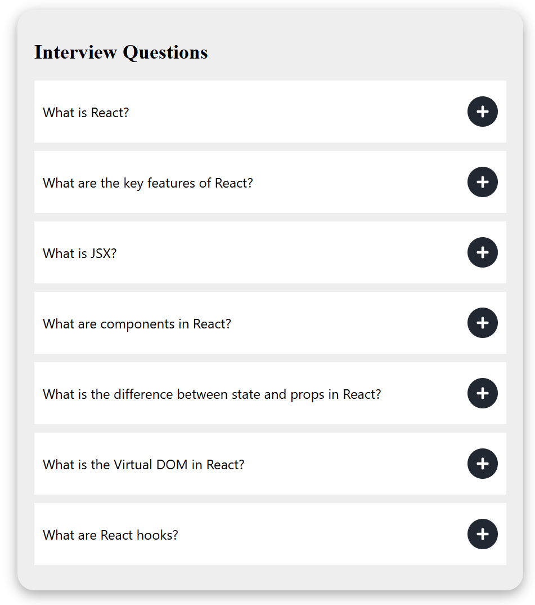

# Accordion Project

This is a simple accordion project built using React's `useState` hook. The accordion allows you to expand and collapse sections by clicking on the `+` and `-` icons.

## Features

- Expand and collapse sections
- Uses `useState` hook for managing state
- Icons change between `+` and `-` based on the state

## Demo



## Installation

1. Clone the repository:

    ```sh
    git clone https://github.com/Piyushchannawar/React-Mini-Projects.git
    cd Accordion
    ```

2. Install dependencies:

    ```sh
    npm install
    ```

3. Start the development server:

    ```sh
    npm run dev
    ```

4. Open your browser and navigate to `http://localhost:5173`.

## Usage

Click on the `+` icon to expand a section and reveal its content. Click on the `-` icon to collapse the section and hide its content.

It is very commonly used in website to answer common questions.
