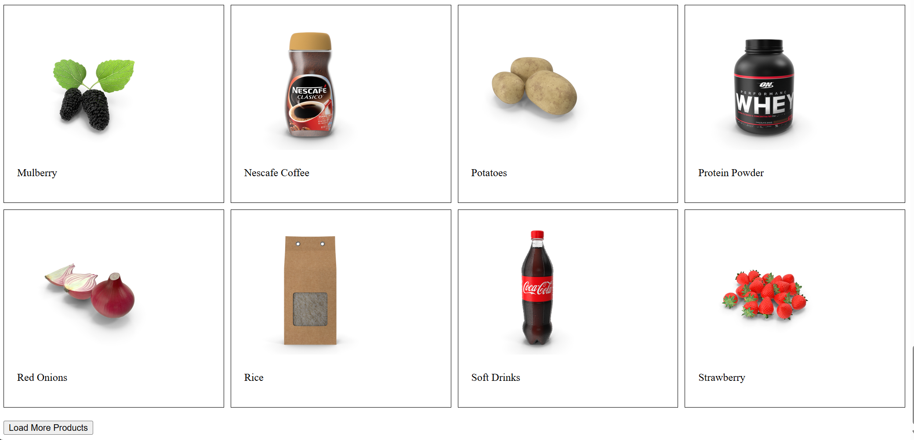

# Load More Data Component

This is a simple Load More Data component built using React. It fetches product data from an API and displays the products. The component includes a button to load more products, and it disables the button once 100 products have been loaded.

## Features

- Fetches and displays product data from an API
- Implements a "Load More" button to fetch additional products
- Disables the "Load More" button once 100 products have been loaded
- Uses React `useState` and `useEffect` hooks for managing state and side effects

## Demo



## Installation

1. Clone the repository:

    ```sh
    git clone https://github.com/Piyushchannawar/React-Mini-Projects.git
    cd Load-More-Data
    ```

2. Install dependencies:

    ```sh
    npm install
    ```

3. Start the development server:

    ```sh
    npm run dev
    ```

4. Open your browser and navigate to `http://localhost:5147`.

## Usage

This component fetches product data from the DummyJSON API and displays the products. Click the "Load More Products" button to load additional products. The button will be disabled once 100 products have been loaded.