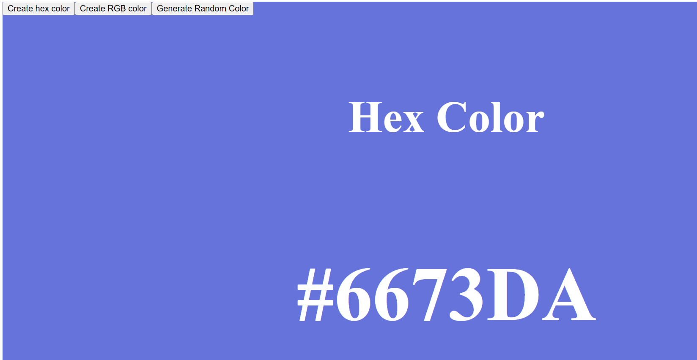

# Random Color Generator

A simple React application that generates random colors in both hex and RGB formats. Users can switch between hex and RGB color modes and generate random colors with a click of a button. The background color of the application changes to the generated color.

## Features

- Generates random colors in hex and RGB formats
- Switch between hex and RGB color modes
- Background color changes to the generated color
- Displays the generated color code

## Demo



## Installation

1. Clone the repository:

    ```sh
    git clone https://github.com/Piyushchannawar/Random-Color-Generator.git
    cd Random-Color-Generator
    ```

2. Install dependencies:

    ```sh
    npm install
    ```

3. Start the development server:

    ```sh
    npm run dev
    ```

4. Open your browser and navigate to `http://localhost:5173`.

## Usage

1. Open the application in your browser.
2. Click the "Create hex color" button to switch to hex color mode.
3. Click the "Create RGB color" button to switch to RGB color mode.
4. Click the "Generate Random Color" button to generate a random color in the selected mode.
5. The background color will change to the generated color, and the color code will be displayed on the screen.